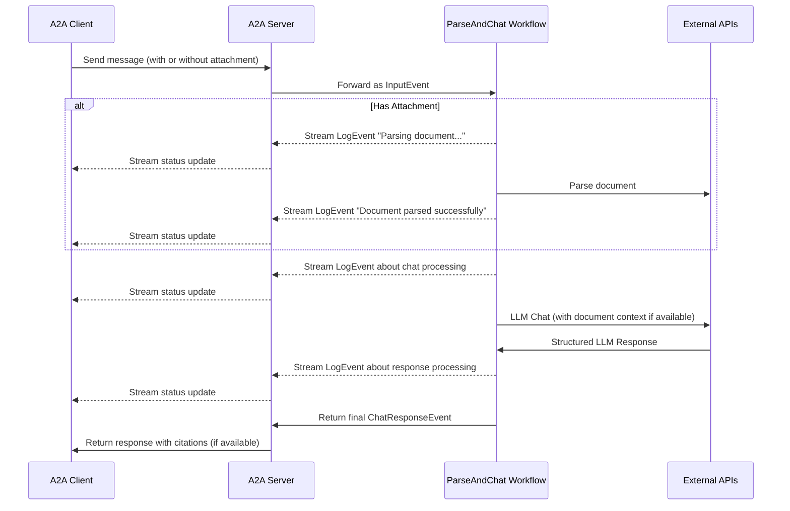

# 🤖 LlamaIndex File Chat Agent

> A powerful conversational agent that can understand and chat about your documents using LlamaIndex and A2A Protocol

[](https://www.python.org/downloads/)
[](https://google.github.io/A2A/)

---

## 📚 Overview

This project demonstrates a state-of-the-art conversational agent built with [LlamaIndex Workflows](https://docs.llamaindex.ai/en/stable/understanding/workflows/) and exposed through the A2A (Agent-to-Agent) protocol. It enables natural conversations about your documents with features like file parsing, multi-turn dialogue, and real-time streaming responses.

---

### Architecture



---

## 🏗️ Project Structure

```
.
├── README.md                 # This file
├── agents/                   # Agent implementations
│   └── llama_index_file_chat/  # LlamaIndex file chat agent
├── hosts/                    # Host implementations
│   ├── cli/                 # Command-line interface host
│   ├── multiagent/          # Multi-agent host implementation
│   ├── streamlit/           # Streamlit web interface host
│   ├── agent.py             # Base agent implementation
│   ├── __init__.py          # Package initialization
│   └── README.md            # Host documentation
├── common/                   # Shared utilities and components
├── .env                     # Environment variables (create this)
├── pyproject.toml           # Project dependencies and metadata
├── uv.lock                  # UV package manager lock file
├── .python-version          # Python version specification
├── .gitignore              # Git ignore rules
└── .vscode/                # VS Code configuration
```

---

## 🔑 What is A2A?

A2A (Agent-to-Agent) is a standardized protocol for agent communication that enables:

- **Standardized Communication**: Common interface for agent interactions
- **Real-time Updates**: Streaming responses and status updates
- **Multi-modal Support**: Handle text, files, and other data types
- **Session Management**: Maintain conversation context
- **Push Notifications**: Webhook-based updates
- **Security**: JWK authentication for secure communications

---

## ✨ Key Features

- 📄 **Smart File Processing**

  - Upload and parse various document formats
  - Intelligent content extraction
  - Context-aware responses

- 💬 **Advanced Chat Capabilities**

  - Multi-turn conversations
  - Context retention
  - In-line citations with source references

- 🔄 **Real-time Experience**

  - Live status updates
  - Streaming responses
  - Progress indicators

- 🔒 **Enterprise Ready**
  - Session management
  - Secure communications
  - Scalable architecture

---

## 🚀 Getting Started

### Prerequisites

Before we begin, make sure you have:

- Python 3.12 or higher installed
- [UV](https://docs.astral.sh/uv/) package manager installed
- Google Gemini API key ([Get it here](https://aistudio.google.com/))
- LlamaParse API key ([Get it here](https://cloud.llamaindex.ai/project/073112ec-6bcb-464a-bbbe-0915fe1fff6b))
- Sample file for testing: `Reference MSA Document.pdf` (included in the repository)

---

### Step-by-Step Setup Guide

Let's set up the project together:

1. **Clone and Navigate**

   ```bash
   # Clone the repository
   git clone <repository-url>

   # Move into the project directory
   cd <repository-name>
   ```

2. **Set Up Environment Variables**

   **Note : You can set the environment variables directly in your terminal:**

   **PowerShell:**

   ```powershell
   # Set your Google API key
   $env:GOOGLE_API_KEY="your_google_api_key_here"

   # Set your Llama Cloud API key
   $env:LLAMA_CLOUD_API_KEY="your_llama_cloud_api_key_here"
   ```

3. **Start the Agent Server**

   ```bash
   # Navigate to the agent directory
   cd agents/llama_index_file_chat

   # Run the agent server
   uv run .
   ```

   You should see a message indicating the server is running on port 10010.

4. **Launch the Streamlit Interface**

   Open a new terminal window and run:

   ```powershell
   # Navigate to the streamlit host directory
   cd hosts/streamlit

   # Install dependencies
   pip install -r requirements.txt

   # Run the Streamlit app
   streamlit run app.py
   ```

   The Streamlit interface will automatically open in your default web browser at `http://localhost:8501`

---

### Using the Interface

Now that everything is set up, you can:

1. Upload documents through the Streamlit interface
2. Ask questions about your documents
3. Get real-time responses with citations

> 💡 **Note**:
>
> - Keep both terminal windows open while using the application
> - The agent server must be running for the Streamlit interface to work

## 📺 **Watch the Tutorial**: [How to Use the Interface](https://pragyaallc-my.sharepoint.com/:v:/g/personal/sachin_parmar_legalgraph_ai/ERseQqIMZtVJi-t6XhO9z70BVI6HjcyyYq3-53yYB6peYw?e=kMwQ6D&nav=eyJyZWZlcnJhbEluZm8iOnsicmVmZXJyYWxBcHAiOiJTdHJlYW1XZWJBcHAiLCJyZWZlcnJhbFZpZXciOiJTaGFyZURpYWxvZy1MaW5rIiwicmVmZXJyYWxBcHBQbGF0Zm9ybSI6IldlYiIsInJlZmVycmFsTW9kZSI6InZpZXcifX0%3D)

---

## 🛠️ Technical Details

### Implementation Highlights

- **LlamaIndex Workflows**: Custom workflow for document parsing and chat
- **Streaming Support**: Real-time updates during processing
- **Context Management**: Session-based memory with persistence options
- **A2A Protocol**: Full compliance with agent communication standards

---

## ⚠️ Limitations

- Text-only output (multimodal support coming soon)
- LlamaParse free tier: 10K credits (~3333 pages)
- In-memory session storage (not persistent)
- Large document handling requires vector DB integration

---

## 📚 Learn More

- [A2A Protocol Documentation](https://google.github.io/A2A/#/documentation)
- [LlamaIndex Workflows](https://docs.llamaindex.ai/en/stable/understanding/workflows/)
- [LlamaParse Documentation](https://github.com/run-llama/llama_cloud_services/blob/main/parse.md)
- [Google Gemini API](https://ai.google.dev/gemini-api)
